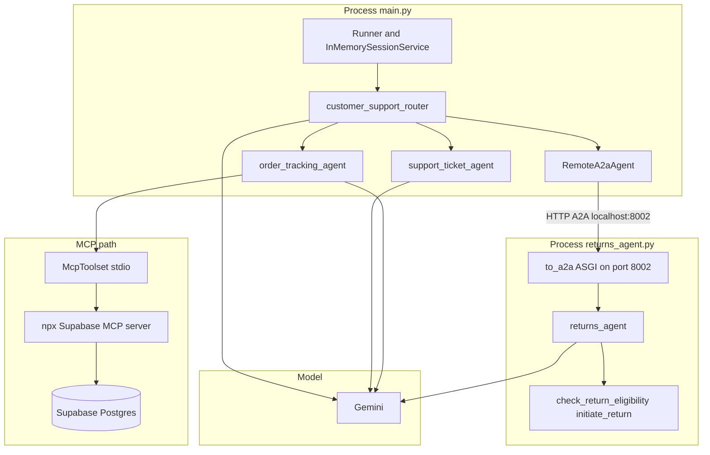

# Project Week 3 — Multi-agent customer support (ADK)

Single-process **router** plus three specialist paths: **local ticket tools**, **Supabase via MCP**, and a **returns specialist** exposed over **A2A** in a separate HTTP service. The stack uses [Google ADK](https://github.com/google/adk-python), **Gemini**, the **Model Context Protocol (MCP)** for Supabase, and **Agent-to-Agent (A2A)** for the remote returns agent.

## High-level architecture



### How requests flow

1. **`main.py`** builds a user message, runs **`Runner.run_async`** with **`root_agent`** (`customer_support_router`).
2. The **router** (LLM) chooses a **sub-agent** from description and instructions: orders, tickets, or returns.
3. **Order path:** `order_tracking_agent` uses **McpToolset** to talk to the **Node `@supabase/mcp-server-supabase`** subprocess, which queries your **Supabase** project.
4. **Support path:** `support_ticket_agent` calls **in-process Python tools** (`search_tickets`, `create_ticket`, `update_ticket_status`) with mock data.
5. **Returns path:** `RemoteA2aAgent` calls the **A2A** app served by **`returns_agent.py`** (run **uvicorn** separately). That service runs its own **`returns_agent`** and tools against mock return rules.

## Prerequisites

- Python 3.10+ (project tested in a 3.14-capable environment with pinned deps).
- **Node.js** and **npx** (for the Supabase MCP server).
- **Gemini API key** and, for orders, **Supabase** access token and project ref.

## Setup

1. Create a virtual environment (optional) and install dependencies:

   ```bash
   pip install -r requirements.txt
   ```

2. Copy `.env.example` to `.env` and fill in values. **Never commit `.env`.**

3. Corporate networks: if MCP or A2A fail with proxy errors, clear or bypass proxy for **localhost** in the terminals running `main.py` and `uvicorn` (see project docstring in `main.py`).

## Run

**Terminal A — returns A2A service (needed for the RETURNS scenario):**

```bash
uvicorn returns_agent:app --host 127.0.0.1 --port 8002
```

**Terminal B — demo scenarios:**

```bash
python main.py
```

## Project files

| File | Role |
|------|------|
| `main.py` | Router, order MCP agent, support tools, `RemoteA2aAgent`, demo `ask()` loop |
| `returns_agent.py` | Returns tools, ADK agent, `to_a2a()` ASGI app |
| `requirements.txt` | `google-adk[a2a]`, `mcp`, `uvicorn`, etc. |
| `.env.example` | Template for secrets and config |

## Notes

- ADK’s **A2A client/server helpers** may log **experimental** warnings; the underlying A2A protocol is standard.
- Returns eligibility in `returns_agent.py` is **mock data** for demonstration, not live Supabase.
